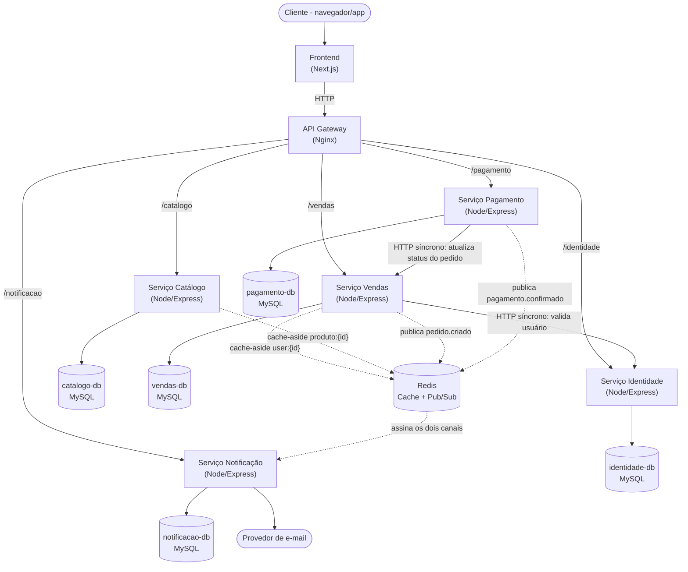

# C4 — Nível 2: Diagrama de Containers

Abre a caixa "Sistema MCEcelulares" e mostra as peças internas: os 5 microsserviços, o gateway, o Redis e os bancos de dados.

## Containers

| Container | Tecnologia | Responsabilidade |
|---|---|---|
| Frontend | Next.js | Telas do e-commerce (home, produtos, conta, carrinho, etc.) |
| API Gateway | Nginx | Ponto único de entrada, roteia por prefixo pra cada serviço |
| Serviço Identidade | Node/Express + Sequelize | Usuários, autenticação, endereços, cargos/permissões |
| Serviço Catálogo | Node/Express + Sequelize | Produtos, categorias, marcas, busca e filtros |
| Serviço Vendas | Node/Express + Sequelize | Carrinho, criação e acompanhamento de pedidos |
| Serviço Pagamento | Node/Express + Sequelize | Processamento e status de pagamento |
| Serviço Notificação | Node/Express + Sequelize | Envio de e-mails transacionais e formulário de contato |
| Redis | Redis | Cache-aside (usuário, produto) e mensageria Pub/Sub |
| Bancos MySQL | MySQL (x5) | Um banco isolado por serviço, sem FK entre eles |
