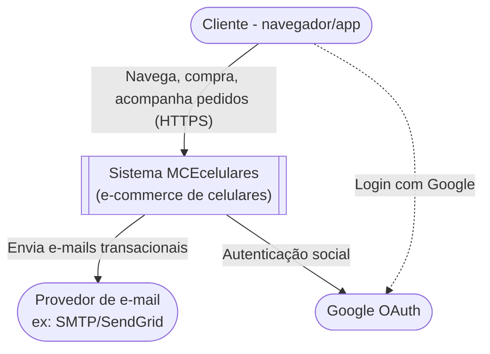

# C4 — Nível 1: Diagrama de Contexto

Mostra o sistema MCEcelulares como uma caixa única e quem interage com ele, sem entrar em detalhes internos.

## Atores e sistemas externos

| Ator/Sistema | Papel |
|---|---|
| Cliente | Usuário final que navega, compra produtos e acompanha pedidos pelo site |
| Google OAuth | Provedor externo de autenticação (login social) |
| Provedor de e-mail | Envia e-mails de pedido confirmado / pagamento confirmado / contato |

## Escopo
O sistema MCEcelulares é uma plataforma de e-commerce de celulares e acessórios, composta internamente por 5 microsserviços (detalhado no diagrama de Containers). Para o cliente final, tudo é acessado como um sistema único através do Gateway.
